# Welcome to MkDocs

For full documentation visit [mkdocs.org](https://www.mkdocs.org).

## Workflow

```mermaid
flowchart LR
    subgraph ETL[Pipeline]
        A[Multiplos arquivos Excel] --> B[Extract: extract_from_excel]
        B[Extract: extract_from_excel] --> |Gera uma lista de Dataframes| C[Transformation: consolidate_dataframes]
        C[Transformation: consolidate_dataframes] --> |Gera um Dataframe consolidado| D[Load: Converte para Excel]
        D[Load: Converte para Excel] --> |Salva o consolidado em Excel| E[Pasta Output: Um arquivo único Excel]
    end
```

## Project layout

    mkdocs.yml    # The configuration file.
    docs/
        index.md  # The documentation homepage.
        ...       # Other markdown pages, images and other files.
